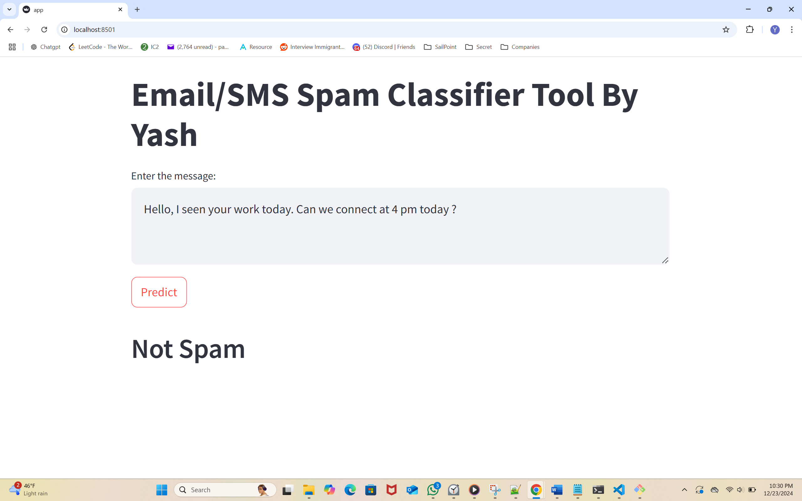
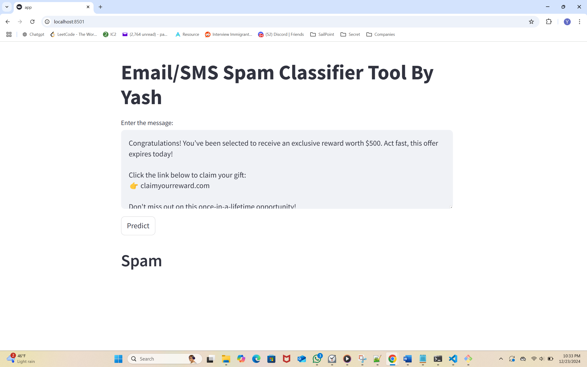

# **Spam Email and SMS Classifier**

A machine learning-based tool to classify emails and SMS messages as either spam or legitimate. This tool uses advanced text preprocessing techniques and machine learning models to ensure high accuracy and reliability.

---

## **Demo**

Here’s a quick look at the tool in action:

**Model classifies text as not spam**


**Model classifies text as spam**


---
## **Features**
- 📧 **Spam Detection**: Classifies email and SMS content into "Spam" or "Not Spam."
- 🔍 **Text Analysis**: Extracts key features from message content for precise classification.
- 📊 **Machine Learning Models**: Trained on labeled datasets for robust performance.
- 🧹 **Text Preprocessing**: Includes tokenization, stop-word removal, stemming, and lemmatization.

---

## **Tech Stack**

### **Programming Language:**
- Python

### **Libraries and Frameworks:**
- **scikit-learn (sklearn):** Machine learning models and pipelines.
- **NLTK:** Natural Language Toolkit for text preprocessing (e.g., tokenization, stopword removal).
- **TfidfVectorizer:** For feature extraction using the Term Frequency-Inverse Document Frequency method.
- **pandas & numpy:** Data manipulation and numerical computations.

---

## **How It Works**

1. **Preprocessing:**
   - Text cleaning: Removing special characters, numbers, and extra spaces.
   - Tokenization: Splitting text into words.
   - Stop-word removal: Eliminating common, non-informative words (e.g., "is," "and").
   - Stemming/Lemmatization: Converting words to their root form.

2. **Feature Extraction:**
   - Utilizes **TfidfVectorizer** to transform the text into numerical features that the model can process.

3. **Model Training:**
   - Trained on datasets containing labeled spam and non-spam messages.
   - Algorithms like Naïve Bayes, Logistic Regression, or Support Vector Machines (SVM) are employed for classification.

4. **Prediction:**
   - Classifies new messages as spam or not spam with a confidence score.

---

## **Installation**

1. Clone this repository:
   ```bash
   git clone https://github.com/yourusername/spam-classifier.git
   cd spam-classifier
2. Install dependencies using pip:
   ```bash
   pip install -r requirements.txt
3. Now run the app using streamlit:
   ```bash
   streamlit run app.py
